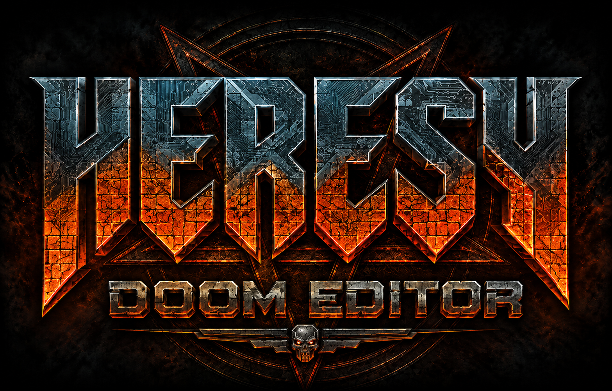

<p align="center">
  
</p>

<h1 align="center">Heresy Editor</h1>

<p align="center">
  A fast, preservation-minded map editor for Doom-engine games, built for
  modern project authoring and first-class BiasedDoom workflows.
</p>

<p align="center">
  <a href="https://github.com/EricsonWillians/heresy-editor/actions/workflows/build-artifacts.yml"></a>
  <a href="https://github.com/EricsonWillians/heresy-editor/actions/workflows/codeql-analysis.yml"></a>
  <a href="https://github.com/EricsonWillians/heresy-editor/actions/workflows/biaseddoom-compatibility.yml"></a>
  <a href="https://github.com/EricsonWillians/heresy-editor/releases/latest"></a>
  <a href="GPL.txt"></a>
</p>

Heresy Editor continues the Eureka Editor codebase with an emphasis on making
whole maps and campaigns safer and dramatically faster to design. It supports
Linux, Windows, and macOS; Doom, Hexen, and UDMF maps; and the Doom, Doom II,
Final Doom, Freedoom, HacX, Heretic, Hexen, and Strife game families.

## Why Heresy Editor?

- **Smart Sector Designer** — draw rectangles, detailed polygons, concave
  rooms, extrusions, rings, routed corridors, stairs, lifts, and architectural
  layouts through one live, format-quantized workflow.
- **Smart Doors** — turn existing sectors or extrusion seams into verified
  local doors with inferred face/track textures and format-correct activation.
- **Architecture that fits the map** — place pillars, arcades, cloisters,
  naves, apses, rotundas, sanctuaries, and more inside ordinary, concave, or
  holed sectors with visible validation before committing.
- **Campaign-scale editing** — manage WAD and PK3 projects, map order, titles,
  episodes, normal/secret routes, entry points, and generated runtime ZMAPINFO.
- **Preservation first** — protect existing specials, doors, lifts, extended
  UDMF properties, unknown PK3 content, undo history, and unsaved multi-map
  work.
- **Fast test loop** — automatically discover BiasedDoom or GZDoom on each
  platform and preserve Undo/Redo across Save and Test in Game.

Every Smart authoring gesture is planned without modifying the document,
previewed with proposed and conflicting geometry, revalidated on commit, and
applied as one atomic Undo operation.

## Download

Tested packages and matching SHA-256 checksums are published on the
[latest release page](https://github.com/EricsonWillians/heresy-editor/releases/latest).

| Platform | Architectures | Package |
| --- | --- | --- |
| Linux | x86_64, arm64 | Portable `.tar.gz` |
| Windows | x86_64, x86 | Portable `.zip` |
| macOS | Apple silicon, Intel | `.dmg` |

macOS packages are ad-hoc signed for integrity but are not Apple-notarized.

## Quick start

1. Download and verify the package for your platform.
2. Launch `heresy` and select an IWAD when prompted.
3. Create or open a WAD/PK3 project.
4. In Sector mode, press <kbd>Ctrl</kbd>/<kbd>Cmd</kbd> +
   <kbd>Shift</kbd> + <kbd>S</kbd> to open Smart Sector Designer.
5. Select **BiasedDoom** or another supported source port, then use
   **Tools → Test in Game**.

Heresy Editor searches environment overrides, `PATH`, portable/build
locations, the user home directory, and platform installation roots for
compatible test engines. Linux executables do not need an `.exe` suffix.

## Smart authoring

### Sectors and architecture

The nonmodal Smart Sector Designer stays open across repeated commits and
offers:

- rooms, 3–288 vertex polygon profiles, and concave freeform outlines;
- inward/outward extrusion and inset/ring operations;
- ranked straight, L, Z, and waypoint corridors;
- generated or existing-sector stairs;
- tagged lift platforms and wall alcoves;
- Open, Wall, or Smart Door endpoint semantics;
- 16 architectural layouts and seven structural styles.

Architecture locks the sector under the first unsnapped press. That makes
layouts reliable inside deeply concave rooms and around holes even when the
footprint center is void. Valid structures remain visible in their dedicated
preview role; blocked intent remains red with exact point/line diagnostics.

Read the complete [Smart Sector Designer guide](docs/SmartSectors.txt).

### Doors

Smart Door reviews all selected sectors as a batch, resolves compatible
configuration-declared presets, infers loaded textures deterministically, and
shows portal/track geometry before changing the map. The same semantics are
available directly from the Extrude pipeline.

Read the [Smart Door guide](docs/SmartDoors.txt).

## Projects, campaigns, and recovery

- Atomic **Save Project** and **Save All** for WAD and PK3 projects.
- Campaign Navigator with bounded resident-map caching and independent history.
- Validated project sessions with portable IWAD hints.
- Rotating, per-map recovery snapshots that never overwrite the project.
- Read-only campaign graph, PK3 metadata, and resource-collision diagnostics.
- Previewed ZMAPINFO generation that refuses to overwrite user-authored
  MAPINFO-family declarations.

See [Project and campaign workflows](docs/Projects.txt) and
[BiasedDoom integration](docs/BiasedDoom.txt).

## Build from source

The supported entry point is:

```bash
./build.sh --clean --type Release --test
```

On Debian/Ubuntu, install:

```bash
sudo apt-get install build-essential clang cmake ninja-build \
  libgl-dev libglu1-mesa-dev libjpeg-dev libpng-dev libxpm-dev \
  libz-dev python3
```

CMake 3.28+ and a C++20 compiler are required. FLTK and GoogleTest use
project-pinned revisions unless system dependency options are requested.
See [INSTALL.txt](INSTALL.txt) for compiler, installation, packaging, and
platform-specific details.

## Pipeline and release integrity

The live badges above report the `master` branch status. The release workflow
builds and tests:

- Linux x86_64 with GCC and Clang;
- Linux arm64 with GCC;
- Windows x86 and x86_64;
- macOS Intel and Apple silicon.

Every version tag must match `CMakeLists.txt` and a versioned changelog. The
release job verifies every generated SHA-256 checksum before it publishes or
updates the GitHub Release. CodeQL analyzes C++ and Python, while the scheduled
BiasedDoom compatibility contract detects upstream release or metadata drift.

## Documentation

- [Complete bundled manual](README.txt)
- [Installation and distribution](INSTALL.txt)
- [Smart Sector Designer](docs/SmartSectors.txt)
- [Smart Doors](docs/SmartDoors.txt)
- [Projects and roadmap](docs/Projects.txt)
- [BiasedDoom compatibility](docs/BiasedDoom.txt)
- [Authors and contributors](AUTHORS.md)

## License

Heresy Editor is distributed under the
[GNU General Public License, version 2](GPL.txt). Vendored dependencies retain
their own license notices.
